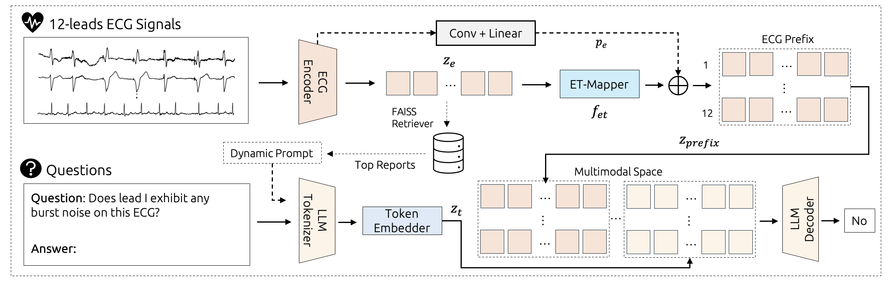

<div align="center" style="font-size: 5em;">
  <strong>Q-HEART: ECG Question Answering via Knowledge-Informed Multimodal LLMs (ECAI 2025)</strong>
  <br> </br> 
</div>

<div align="center"> 
<a href="https://github.com/manhph2211/Q-HEART/"></a>
<a href="https://arxiv.org/pdf/2505.06296"></a>
<a href="https://huggingface.co/Manhph2211/Q-HEART"></a>
</div>

<div align="center">
  <a href="https://github.com/manhph2211/" target="_blank">Hung&nbsp;Manh&nbsp;Pham</a> &emsp;
  <a href="" target="_blank">Jialu&nbsp;Tang</a> &emsp;
  <a href="https://aqibsaeed.github.io/" target="_blank">Aaqib&nbsp;Saeed</a> &emsp;
  <a href="https://www.dongma.info/" target="_blank">Dong&nbsp;Ma</a> &emsp;
</div>
<br>


## 🚀 Introduction

This repository contains the official implementation of Q-HEART, a novel multimodal framework for Electrocardiogram (ECG) Question Answering (ECG-QA). Q-HEART is designed to bridge the gap between complex physiological ECG signals and natural language understanding, enabling automated systems to accurately answer clinical questions directly from ECG data.

Our work addresses the limitations of existing approaches by integrating a powerful, adapted ECG encoder with textual information via a specialized ECG-aware transformer-based mapping layer (ET-Mapper). Furthermore, Q-HEART leverages dynamic prompting and retrieval of relevant historical clinical reports to guide the language model towards knowledge-aware ECG reasoning.


<div align="center">
    
</div>

## 📖 Usage

[1] First, we need to create a Python environment and install the following:

```
git clone https://github.com/manhph2211/Q-HEART.git && cd Q-HEART
conda create -n qheart python=3.9
conda activate qheart
pip install torch --index-url https://download.pytorch.org/whl/cu118 # cuda 11.18
pip install -r requirements.txt
```

[2] Then, we need to pre-process the PTB-XL and MIMIC IV (ECG-QA) folder that will contain `.mat` files. We can put them under `data/processed` directory.

- MIMIC-IV-ECG v1.0: Used for pre-training the ECG-text multimodal model and building the FAISS index for report retrieval.

- PTB-XL: Used for zero-shot performance validation of the trained ECG encoder.

- CODE-15: Used for validating the ECG encoder's performance against human experts.

- ECG-QA: The primary dataset for fine-tuning and evaluating Q-HEART on the ECG-QA task, comprising curated questions and answers about PTB-XL ECG QA samples.

Note: MIMIC-ECGQA and PTB-XL datasets in raw form are available [here](https://github.com/Jwoo5/ecg-qa/tree/master).

Note: Data splits can also be found at [here](https://github.com/Jwoo5/ecg-qa/tree/master). We put them inside `data/manifest`.

[3] Run training experiement as `python main.py`, see the arguments in `main.py`. Note that the ECG encoder should be well-trained before training the multimodal LLM, and the processed data should contain the retrieved contexts by now. 

[4] To evaluate the model, you can use `python main.py --eval` to evaluate the model on the chosen test set. You can play with some post-processing (e.g., answer order, terminological variation, none) and some decoding parameters (e.g., BEAMS, TOPK, TEMP) for optimal results.

## 📄 Future Work

Several exciting directions for future research are identified:

- Enhanced Numerical Reasoning: Incorporate conventional ECG-derived features (e.g., heart rate, interval durations) into the prompt context to improve numerical reasoning for query-type questions.

- Larger, Medically Fine-tuned LLMs: Explore integrating larger language models that have undergone medical pre-training to potentially further enhance reasoning capabilities.

- Knowledge Graph Integration: Inject graph-structured clinical entities and relations (e.g., arrhythmia types and their relationships) into ECG features to improve question-answering performance and interpretability.

We are open to collaboration and welcome contributions from the community. If you are interested in working together or have any discussion, please feel free to reach out!